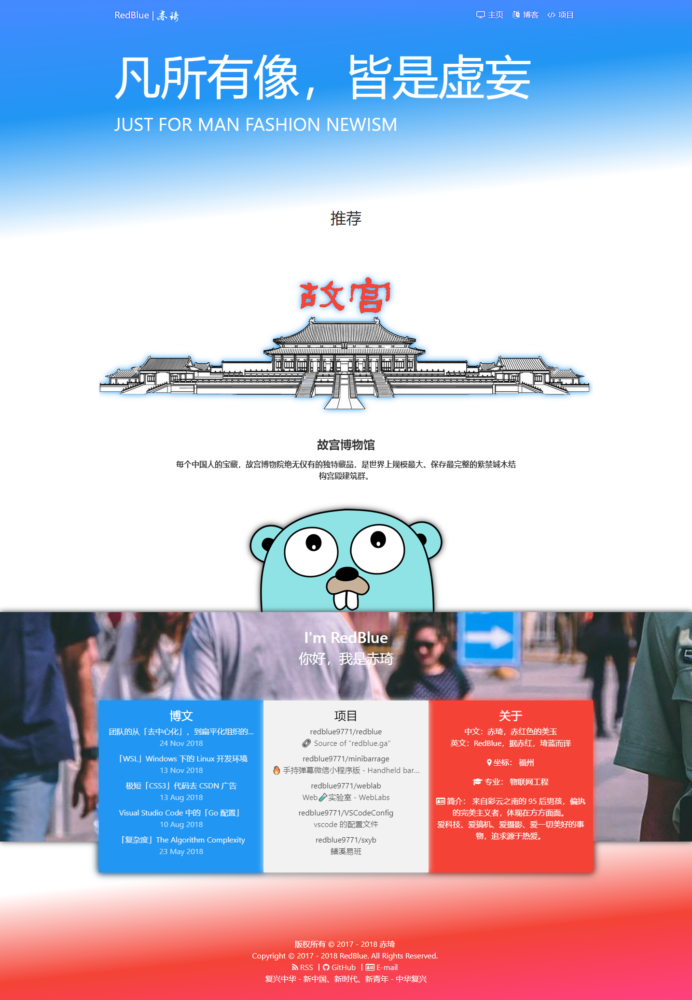
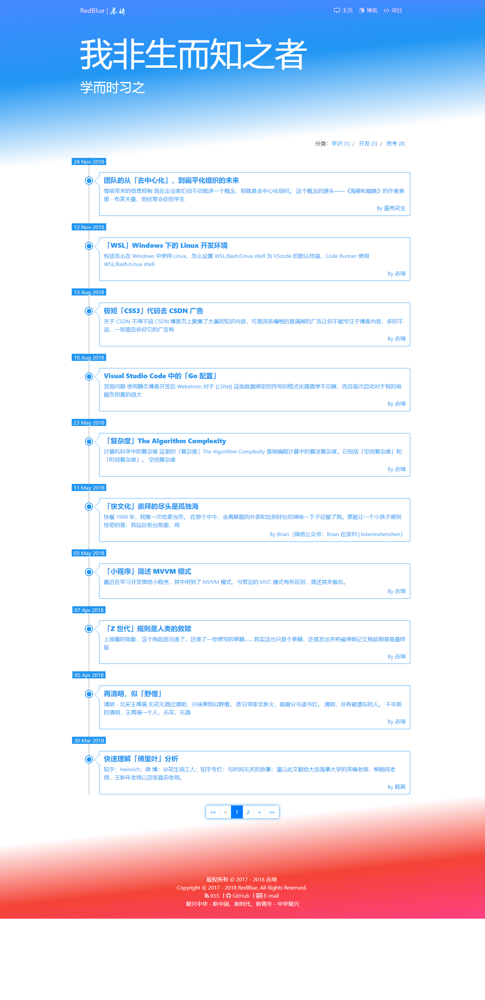

# RedBlue | 赤琦

💻 This is a website deployment source for ["https://redblue.ga"](https://redblue.ga/)

## Showcase

💎 Perfect response (Base on Bootstrap)

<div>
    <details open>
        <summary>Home</summary>
        
    </details>
    <details>
        <summary>List</summary>
        
        <p><strong>↑ 此张截图有误，应该是两列式的时间轴 (：来自 Chrome 截图工具的错误……</strong></p>
    </details>
    <details>
        <summary>Project</summary>
        
    </details>
    <details>
        <summary>404</summary>
        
    </details>
    <details>
        <summary>Post (Friendly typography)</summary>
        
    </details>
    <details>
        <summary>Mobile</summary>
        
    </details>
</div>

## Main irectories

```bash
.
├── content
│   ├── organizations
│   │   └── index.md
│   ├── repositories
│   │   └── index.md
│   ├── richs
│   │   ├── discover
│   │   └── pohotographies
│   ├── spirits
│   │   ├── develop
│   │   │   └── index.md
│   │   ├── konwleges
│   │   │   └── index.md
│   │   ├── thinking
│   │   │   └── index.md
│   │   └── index.md
│   └── index.md
├── layouts
│   ├── _default
│   ├── organizations
│   ├── partials
│   ├── repositories
│   ├── spirits
│   ├── index.redirects
│   ├── index.headers
│   ├── 404.html
│   └── index.htnml
├── static
│   ├── admin
│   ├── css
│   ├── img
│   ├── js
│   ├── labs
│   ├── favicon.ico
│   └── robots.txt
├── .gitignore
├── LICENSE
├── README.md
└── config.toml
```

## 🛠 How to use it

Install and add PATH [Hugo](https://gohugo.io)

```bash
cd $filespace
hugo server
// open http://localhost:1313 with Browser
```

## ⚖️ LICENSE

💷 Some website content is licensed under a [Creative Commons Attribution-NonCommercial-ShareAlike 4.0 International License. (CC BY-NC-SA 4.0)](https://creativecommons.org/licenses/by-nc-sa/4.0/)

👉 These source code are licensed under a [MIT License.](https://github.com/redblue9771/redblue/blob/master/LICENSE)