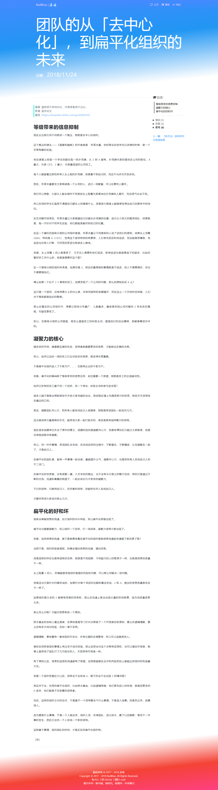

# RedBlue | 赤琦

This is a website deployment source for ["https://redblue.fun"](https://redblue.fun)

[](https://app.netlify.com/sites/redblue/deploys)


## Built With

* [Hugo](https://github.com/gohugoio/hugo) - A Fast and Flexible Static Site Generator built with love by bep, spf13 and friends in Go.
* [Bootstrap](https://github.com/twbs/bootstrap) - Sleek, intuitive, and powerful front-end framework for faster and easier web development.
* [Bootstrap.Native](https://github.com/thednp/bootstrap.native) - The jQuery plugins for Bootstrap 4 redeveloped with native JavaScript, providing same basic functionality, but lighter in size and delivering higher performance for your application.


## Showcase

<div>
    <details open>
        <summary>Home</summary>
        
    </details>
    <details>
        <summary>List</summary>
        
        <p><strong>↑ 此张截图有误，应该是两列式的时间轴 (：来自 Chrome 截图工具的错误……</strong></p>
    </details>
    <details>
        <summary>Project</summary>
        
    </details>
    <details>
        <summary>404</summary>
        
    </details>
    <details>
        <summary>Post (Friendly typography)</summary>
        
    </details>
    <details>
        <summary>Mobile</summary>
        
    </details>
</div>

## Main Directories

```bash
.
├── content
│   ├── repositories
│   │   └── index.md
│   ├── spirits
│   │   ├── develop
│   │   │   └── index.md
│   │   ├── knowledge
│   │   │   └── index.md
│   │   ├── thinking
│   │   │   └── index.md
│   │   └── index.md
│   └── index.md
├── data
│   └── api.toml
├── layouts
│   ├── _default
│   ├── organizations
│   ├── partials
│   ├── repositories
│   ├── spirits
│   ├── shortcodes
│   ├── taxonomy
│   ├── index.redirects
│   ├── index.headers
│   ├── 404.html
│   └── index.html
├── static
│   ├── admin
│   ├── fonts
│   ├── img
│   ├── labs
│   ├── favicon.ico
│   └── robots.txt
├── assets
│   ├── css
│   └── js
├── LICENSE
├── README.md
└── config.toml
```

## Running the tests

1、 Install and add PATH [Hugo](https://gohugo.io)

2、 Bash
```bash
cd $filespace
hugo server
```

2、 Open http://localhost:1313 with Browser

## License

💷 Some website content is licensed under a [Creative Commons Attribution-NonCommercial-ShareAlike 4.0 International License. (CC BY-NC-SA 4.0)](https://creativecommons.org/licenses/by-nc-sa/4.0/)

👉 This project is licensed under the MIT License - see the [LICENSE](LICENSE) file for details
